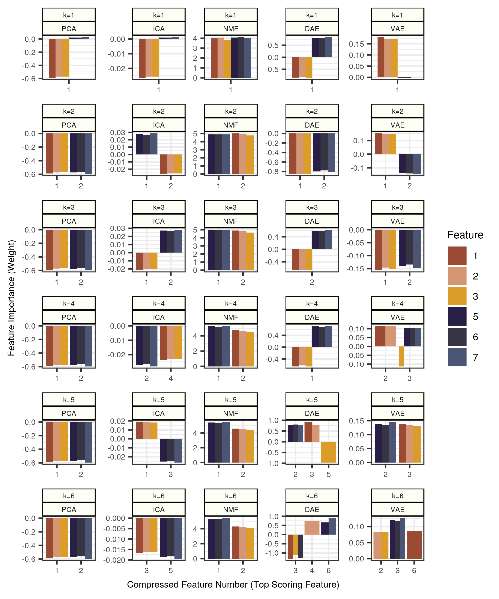

# Simulate Compressed Feature Extraction

## Simulated Data

In the following analysis module, we generate data with two groups of artificial signals.
We generate a 10,000 x 10 matrix where two groups of three features each are highly correlated.
The remaining features are sampled with random Gaussian noise.

The two groups of features have different correlation structures.
The first group (features 1, 2, and 3) is simulated to be highly correlated with a range 0.90 - 0.95 (Pearson's correlation).
The second group of features (features 5, 6, 7) is simulated to be correlated to a slightly lesser degree (range: 0.85 - 0.90).

| Group | Correlated Features | Correlation Range |
| :---- | :------------------ | :---------------- |
| 1 | 1, 2, 3 | 0.90 - 0.95 |
| 2 | 5, 6, 7 | 0.85 - 0.90 |

## Experimental Design

For this experiment we apply the BioBombe suite of algorithms (PCA, ICA, NMF, DAE, VAE) across 6 different latent dimensionalities (k = 1, 2, 3, 4, 5, 6).

We fit each model and extract the resulting weight matrix.
We observe the contributions (weights or importance scores) of each input raw feature to each compressed feature.

Our goal is to determine the **number** of the compressed feature that best represents each simulated feature in both groups.

## Results

We observe that most algorithms (from k = 2 and larger) aggregate both groups of artificial signals.
As expected, we observe that PCA models identify the same solution across latent dimensionalities, and that the **compressed feature number** associated with each signal does not change.
Furthermore, the top compressed feature (`pca_0`) isolates signal from the top correlating group.
`pca_1` represents the second, and lower correlated, group.
We see a similar pattern (although flipped by artificial signal strength) in NMF models.

We observe that most ICA, DAE, and VAE models successfully isolate both artificial signals.
DAE with k = 5 and k = 6, and VAE with k = 4 and k = 6 are the only suboptimal models.
In these three algorithms, the **top compressed feature number** is also not consistent.
For example, for VAE k = 5 the top feature isolating signal group 1 is represented by VAE compressed feature 2, while VAE compressed feature 1 represents signal group 2.
We see a similar randomized pattern for other initializations of these models.

## Conclusion

For algorithms other than PCA (such algorithms that rely on random initializations before training), the compressed feature number is unrelated to variance explained in the model.
In these models, the compressed feature number does not contain information about the importance of the extracted representation.
